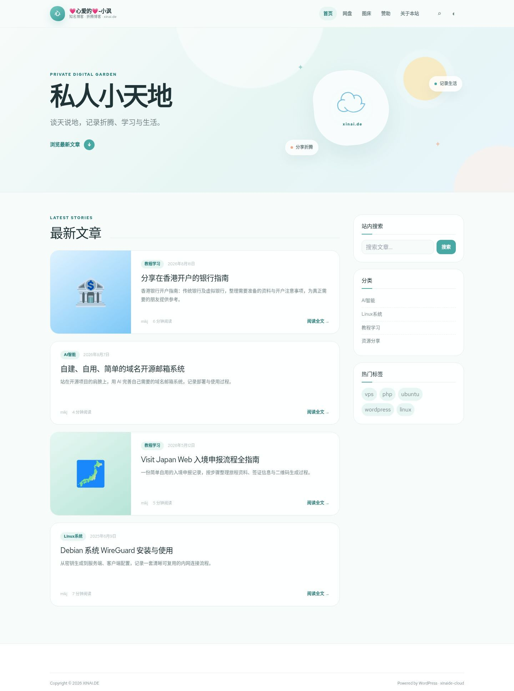

# xinaide-cloud

一款为 [xinai.de](https://www.xinai.de/) 设计的大气沉浸式 WordPress 博客主题。主题延续原站 Kratos 的水景横幅与成熟博客结构，重新设计首页、文章、归档、搜索、页面、404、侧栏和页脚；Vue 3 + [Soybean UI](https://ui.soybeanjs.cn/) 负责搜索、移动菜单与深浅色切换。



## 特性

- 原站水景大横幅、深色导航与更宽阔的编辑式内容布局
- WordPress 原生首页、文章、页面、归档、搜索、404 与评论模板
- Vue 3 + Soybean UI 搜索、移动导航和深浅色切换
- 桌面、平板与手机响应式布局
- 独立「外观 → Xinaide Cloud」主题控制台
- 可设置品牌色、宽度、页头、首页横幅、按钮、数据、文章信息、自动目录、侧栏介绍、二维码、页脚、备案、SEO 与自定义 CSS
- 兼容 Kratos 的 `views` 热度、`love` 点赞、正文首图和旧文章数据
- 自动读取文章第一张图片作为列表封面，并支持默认封面
- 原生 PHP 内容输出，兼顾 SEO、Open Graph 与插件兼容性

## 安装

1. 下载可安装包 [`xinaide-cloud.zip`](releases/xinaide-cloud.zip)，或下载仓库源码 ZIP。
2. 将主题压缩包上传到 WordPress「外观 → 主题 → 安装主题」。
3. 启用后进入「外观 → Xinaide Cloud」设置整站视觉、横幅、文章、侧栏和页脚。
4. 到「外观 → 菜单」设置主导航和页脚导航。
5. 如需添加额外模块，到「外观 → 小工具」设置博客侧栏。

压缩包已包含构建后的前端资源，服务器不需要 Node.js。

## 开发

```bash
npm install
npm run dev
npm run build
```

环境要求：WordPress 6.2+、PHP 7.4+、Node.js 18+（仅二次开发需要）。

## 版本

当前版本：**v1.3.2**

- 修复首页文章缩略图溢出：卡片封面改为固定区域裁剪填充，任何尺寸图片都能自适应
- 修复侧栏重复搜索框：配置小工具后不再显示内置搜索
- 前台卡片与后台控制台全面清爽化（Soybean 风格：小圆角、轻阴影、无衬线列表标题、扁平表单）
- 修复首页文章缩略图：支持懒加载 data-src 图片、跳过表情/占位图、内置默认封面兜底，新增 xinaide-card 裁剪尺寸
- 页脚新增网站运行时间实时计时（建站日期可设置，按 UTC+8 计）
- 页脚新增服务器运行状态入口（链接与文字可设置）
- 页脚社交渠道新增 YouTube，默认对齐原站微博/X/Telegram/YouTube/GitHub/邮箱
- 全面重做大气版首页、内部页横幅与深色品牌页脚
- 新增完整主题后台控制台
- 新增 Kratos 热度、点赞与正文首图数据兼容
- 新增文章自动目录、SEO/Open Graph、社交与备案设置
- 更新桌面与手机完整预览

## 许可证

[GPL-2.0-or-later](LICENSE)
